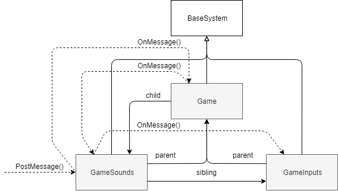

# XiSubsystem


[](https://github.com/hww/XiSubsystem/actions/workflows/ci.yml)
[](https://openupm.com/packages/com.hww.xisubsystem/)
[](https://github.com/hww/XiSubsystem/blob/master/LICENSE)
[](https://github.com/semantic-release/semantic-release)

Base subsystem for any Unity 3D projects created by [hww](https://github.com/hww)

## Introduction

In my projects, the Subsystem is a replacement for the Singletone class. It's a better solution and allows you to make more complex projects without any headaches. Imagine Singletones that can be organized as a tree, but can also be initialized in a few passes -- that's what the Subsystem is for. On top of everything else, each Subsystem can receive and broadcast messages.

This solution was successfully used in several game projects, which made the Singletone class and all its problems unnecessary.
The system organized by tree of subsystems. Each subsystem has fields to buid the tree.

```C#
public partial class BaseSystem
{
        private BaseSystem parent;
        private BaseSystem sibling;
        private BaseSystem children;
}
```

The list below contains methods for making and ispecting the tree.

```C#
public void AddChild(BaseSystem child)
public void RemoveChild(BaseSystem child)
public BaseSystem GetChild(int index)
```

The example of subsystem below. 

```C#
    /// <summary>
    /// Just display all messages in system
    /// </summary>
    public class ConsoleSystem : BaseSystem
    {
        public ConsoleSystem(BaseSystem parent)
        {
            parent.AddChild(this);
        }

        public override void OnMessage(BaseSystem sender, ESustemMessage msg, object arg1, object arg2)
        {
            Debug.LogFormat("[{0:0.00}] {1} arg1: {2} arg2: {3}", Time.time, msg, arg1, arg2);
        }
    }
```

## Messages

Each subsystem may have a method for receiving messages.

```C#
public virtual void OnMessage(BaseSystem sender, ESustemMessage msg, object arg1, object arg2)        
```

To send message there are next method.

```C#
// Deliver the message to all family from top system. 
public virtual void PostMessage(BaseSystem sender, ESustemMessage msg, object arg1 = null, object arg2 = null)
```

Figure below illustrate subsystems tree and message routing.



To prevent a garbage should be used a message container for arg1 and arg2.
